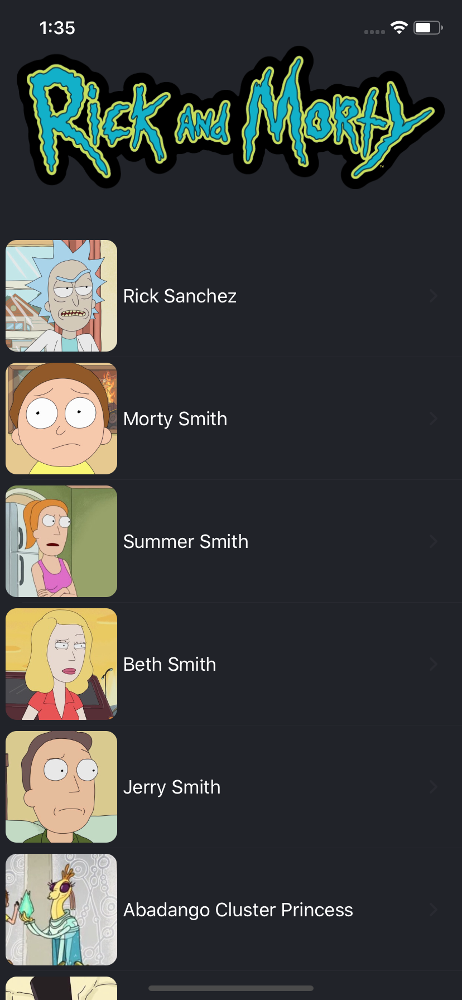
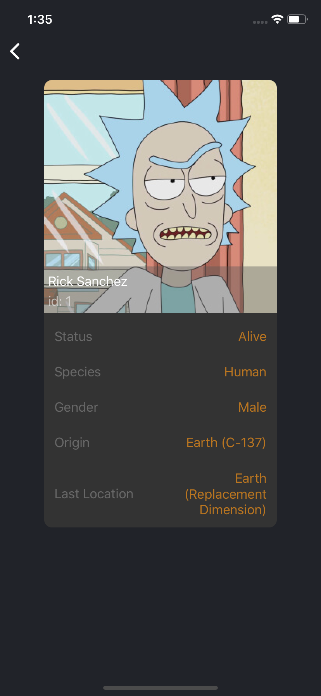

# RickAndMorty

This is a small app demonstrating the use of combine for fetching and updating data

CharactersViewController|CharacterInformationViewController
---|---
|

## Frameworks Used

Quick and Nimble

## Requirements

The app uses Swift Combine so requires XCode 11 and iOS 13 to run
